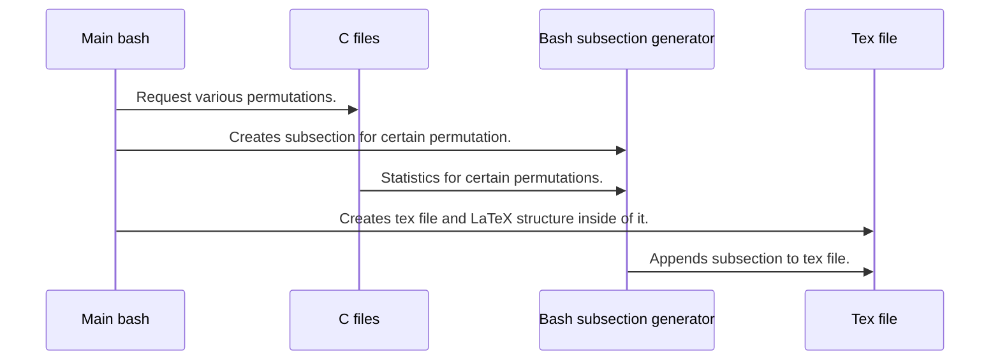

# Permutations document generator 
This project is Linux based tool that gives opportunity to generate pdf document with various permutations as data. It consists of bash scripts which loads all of configuration parameters, also validates them and pass to the c files, where various permutations are given as output. C files also computes statistics for certain permutation.



## Structure of generated pdf
Generated pdf consists of sections for a single demand from a configuration file, for example for nineteen permutations from 5-th element set there will be one section consisting of nineteen subsections. Subsections consist of table of single permutation statistics. If there are more than forty-five elements in set, then longtable will be used instead of tabular. So, pages may be divided for longer element sets.

### Avalaible statistics
- Permutation square
- Permutation inversions
- Number of permutation inversions
- Order of permutation
- Permutation in cycle notation
- Evenness of permutation

## Usage
To use this project, follow instructions given below:
- Create build folder inside project folder.
```bash
mkdir build
```
- Initialize cmake inside of build folder.
```bash
cd build
cmake ..
```
- Build project using make.
```bash
make
```
- Create file which will contain parameters for your program.
- Change permissions for both bash scripts.
```bash
chmod 777 ./pdfGenerator.sh
chmod 777 ./subsectionGenerator.sh
```
- Run program.
```bash
./pdfGenerator <config-file-name>
```

### Configuration file parameters.

It should contain single line with two parameters. First parameter is length of permutation set (max 60), second is number of permutations that will be generated. Config files must end with a single new line. For purpose of generating all possible permutations type 0 as number of permutations parameter.

## Supported languages
Only polish language is supported at this moment.
