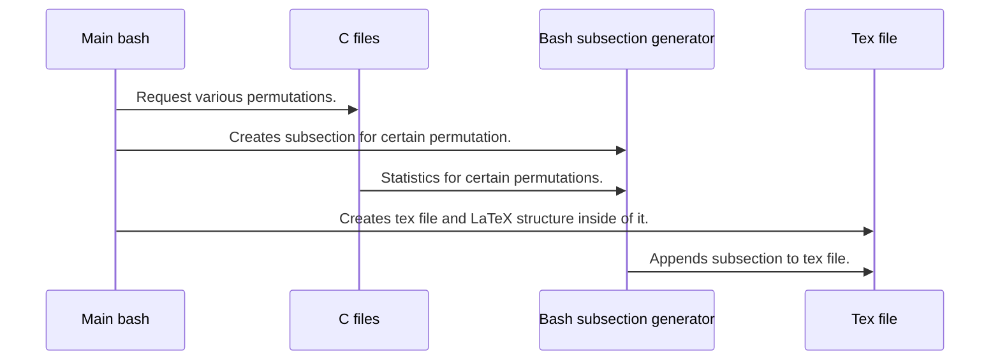

# Permutations document generator 
This project is linux based tool that gives oportunity to generate pdf document with various permutations as data. It consists of bash scripts which loads all of configuration parameters, also validates them and pass to the c files, where various permutations are given as output. C files also computes statistcs for certain permutation.



## Structure of generated pdf
Generated pdf consists of sections for single demand, for example for 19 permutations from 5-th element set. There are also subsections in sections which contains statistcs for every single permutation.

## Usage
To use this project follow instructions given below:
- Create build folder inside project folder.
```bash
mkdir build
```
- Initialize cmake inside of build folder.
```bash
cd build
cmake ..
```
- Build project using make.
```bash
make
```
- Create file which will contain parameters for your program, it should contain single line with 2 parameters. First parameter is length of permutation set (max 60), second is number of permutations that will be generated. Config file have to end with a single new line.
- Change permissions for both bash scripts.
```bash
chmod 777 ./pdfGenerator.sh
chmod 777 ./subsectionGenerator.sh
```
- Run program.
```bash
./pdfGenerator <config-file-name>
```

## Supported languages
Only polish language is supported at this moment.
